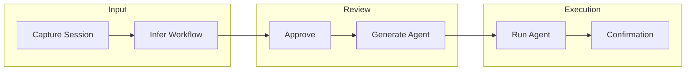
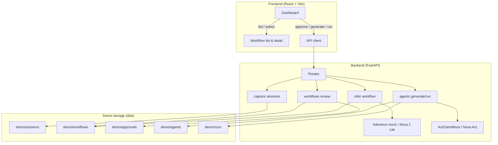

# Shadow Ops – Architecture

## Overview

**Shadow Ops – Expense Report Shadow** infers expense submission workflows from captured user sessions (or prompts) and runs them as automated agents. It is designed to integrate with **Amazon Nova 2 Lite** (workflow inference) and **Amazon Nova Act** (agent execution); the current implementation uses deterministic mocks for both.

## High-level flow



1. **Capture** – User actions are recorded as a capture session (steps, URLs, field labels, optional screenshots).
2. **Infer** – Backend infers a structured workflow (title, parameters, steps, risk) from the session; extension point for Nova 2 Lite.
3. **Approve** – Human reviews and approves the workflow on the dashboard.
4. **Generate Agent** – Approved workflow is turned into an agent spec (parameter schema, steps); extension point for Nova Act.
5. **Run** – Agent runs with supplied parameters; mock supports a UI-change simulation (failure at Submit → recovery → retry with Confirm).
6. **Confirmation** – Run returns a confirmation ID and step-by-step run log.

## Component diagram



## Components

| Component | Description |
|-----------|-------------|
| **Dashboard** | React SPA: workflow list, detail (title, description, parameters, steps), Approve, Generate Agent, Run Agent with parameter form and run-log results. Highlights UI-change adaptation in the log when simulation is used. |
| **API (FastAPI)** | REST endpoints for capture, infer, workflows (list/get/approve), agents (generate/run), health, and schema examples. |
| **Capture** | POST/GET capture sessions; validates steps (non-empty, max 200); persists JSON under `demo/sessions/`. |
| **Inference** | POST infer by session_id; loads session, runs inference (mock or Nova 2 Lite stub), stores workflow under `demo/workflows/`. Mock returns fixed parameters (amount, date, category, description, receipt_file) and steps (navigate, open form, upload receipt, fill, submit, confirmation). |
| **Workflows** | List workflows, get by id, POST approve (stores `demo/approvals/{id}.json`). |
| **Agents** | POST generate (requires approval; creates agent spec, stores `demo/agents/{id}.agent.json`). POST run (loads spec, runs mock, stores `demo/runs/{run_id}.json`; optional simulate_ui_change injects failure/recovery at Submit step). |
| **ActClientMock** | Creates agent spec from workflow; run_agent produces run_log and confirmation_id (e.g. EXP-2026-000123). When simulate_ui_change is true, injects “Step N failed”, “UI changed: Submit renamed to Confirm”, and “Step N retry”. |

## Configuration

- **Backend** – `.env` in `backend/` (see `.env.example`). Key settings: `NOVA_MODE` (mock|real), Nova API keys and endpoints for future real integration.
- **Frontend** – Optional `VITE_API_BASE`; dev server proxies `/api` to `http://localhost:8000` by default.

## Project layout

```
shadow-ops-expense/
├── backend/          # FastAPI app, config, logging, Nova placeholders
│   ├── app/          # routes, services, models
│   ├── prompts/     # Prompt templates (inference_prompt.txt, receipt_extraction_prompt.txt)
│   └── scripts/     # demo_flow.py
├── frontend/         # React app, dashboard, API client
├── demo/             # Sessions, workflows, approvals, agents, runs, sample_logs
├── docs/             # Architecture, demo script, judges notes
└── README.md
```
