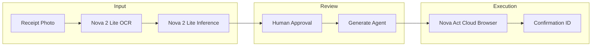
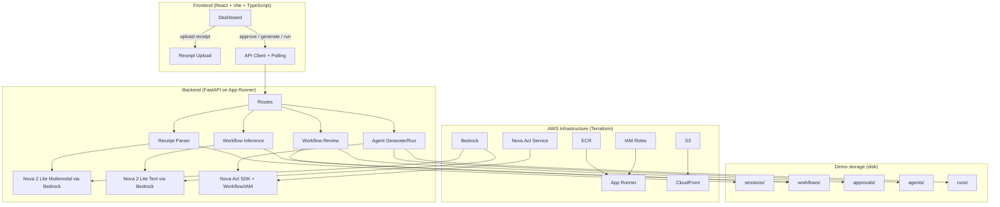

# Shadow Ops – Architecture

## Overview

**Shadow Ops – Expense Report Shadow** automates expense submission by combining **Amazon Nova 2 Lite** (receipt OCR + workflow inference via Bedrock) with **Amazon Nova Act** (cloud browser automation). Upload a receipt photo, and the system extracts fields, infers a workflow, and executes it in a real browser — filling forms, clicking buttons, and returning a confirmation ID.

## High-level flow

```mermaid
flowchart LR
  subgraph Input
    A[Receipt Photo] --> B[Nova 2 Lite OCR]
    B --> C[Nova 2 Lite Inference]
  end
  subgraph Review
    C --> D[Human Approval]
    D --> E[Generate Agent]
  end
  subgraph Execution
    E --> F[Nova Act Cloud Browser]
    F --> G[Confirmation ID]
  end
```

1. **Upload** – User uploads a receipt photo via the dashboard.
2. **Extract** – Nova 2 Lite multimodal extracts amount, merchant, date, category, currency from the image.
3. **Infer** – Nova 2 Lite infers a structured workflow (title, parameters, steps, risk, time saved) from the extracted data.
4. **Approve** – Human reviews and approves the workflow on the dashboard.
5. **Generate Agent** – Approved workflow is turned into an agent spec with parameter schema and execution steps.
6. **Execute** – Nova Act opens a cloud browser on the target expense form, fills fields, submits, confirms, and extracts the confirmation ID using `act_get()`.

## Component diagram

```mermaid
flowchart TB
  subgraph Frontend["Frontend (React + Vite + TypeScript)"]
    UI[Dashboard]
    UI --> |upload receipt| RECEIPT[Receipt Upload]
    UI --> |approve / generate / run| API_CALL[API Client + Polling]
  end

  subgraph Backend["Backend (FastAPI on App Runner)"]
    ROUTES[Routes]
    ROUTES --> REC[Receipt Parser]
    ROUTES --> INFER[Workflow Inference]
    ROUTES --> WF_API[Workflow Review]
    ROUTES --> AGENTS[Agent Generate/Run]
    REC --> NOVA_MM[Nova 2 Lite Multimodal via Bedrock]
    INFER --> NOVA_TXT[Nova 2 Lite Text via Bedrock]
    AGENTS --> ACT[Nova Act SDK + Workflow/IAM]
  end

  subgraph AWS["AWS Infrastructure (Terraform)"]
    ECR[ECR] --> APPRUNNER[App Runner]
    S3[S3] --> CF[CloudFront]
    IAM[IAM Roles] --> APPRUNNER
    BEDROCK[Bedrock] --> NOVA_MM
    BEDROCK --> NOVA_TXT
    NOVAACT_SVC[Nova Act Service] --> ACT
  end

  subgraph Storage["Demo storage (disk)"]
    SESS[sessions/]
    WF_STORE[workflows/]
    APPR[approvals/]
    AG_SPEC[agents/]
    RUNS[runs/]
  end

  API_CALL --> ROUTES
  REC --> SESS
  INFER --> WF_STORE
  WF_API --> WF_STORE
  WF_API --> APPR
  AGENTS --> AG_SPEC
  AGENTS --> RUNS
```

## Components

| Component | Description |
|-----------|-------------|
| **Dashboard** | React SPA: receipt upload with drag-and-drop, workflow list/detail, Approve, Generate Agent, Run Agent with parameter form, live polling timer, run log with highlighted adaptation lines. |
| **Receipt Parser** | Multimodal Nova 2 Lite call extracts structured fields from receipt images. Mock returns fixed data for local dev. |
| **Workflow Inference** | Nova 2 Lite text call infers workflow from session context. Includes JSON parsing with retry, markdown fence stripping, and brace-matching extraction. |
| **Agent Execution** | `ActClientReal`: Nova Act SDK with Workflow/IAM auth. Skips navigate/open_form steps (browser already on target page). Enhances instructions with page-specific context. Retries submit/confirm steps. Extracts confirmation ID via `act_get()`. |
| **Async Pattern** | Real Nova Act runs in background thread. POST /run returns `{status: "running", run_id}` immediately. Frontend polls GET /run/{run_id} every 3s with live timer. Avoids App Runner 120s timeout. |
| **Self-healing** | When a UI element changes (e.g. Submit becomes Confirm), agent detects failure, adapts instruction, and retries. Demonstrated in both mock (simulate_ui_change) and real (retry logic) modes. |

## Configuration

- **Backend** – `.env` (see `.env.example`). Key settings: `NOVA_MODE` (mock/real), `NOVA_ACT_MODE` (mock/real), `AWS_REGION`, `NOVA_ACT_STARTING_PAGE`.
- **Frontend** – `VITE_API_BASE` for production; dev server proxies `/api` to localhost:8000.
- **Infrastructure** – Terraform in `infra/`. Deploy script `infra/deploy.sh` handles full stack deployment.

## Deployment

| Component | AWS Service | Config |
|-----------|------------|--------|
| Backend | App Runner | ECR image, 4096 MB, env vars for real mode |
| Frontend | S3 + CloudFront | OAC, private bucket, SPA routing |
| Registry | ECR | Python 3.12-slim Docker image |
| Permissions | IAM | `bedrock:InvokeModel` + `nova-act:*` |
| IaC | Terraform | `infra/` directory, two-phase apply |
